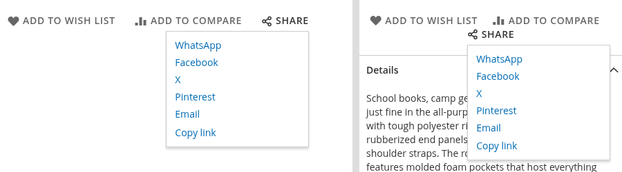
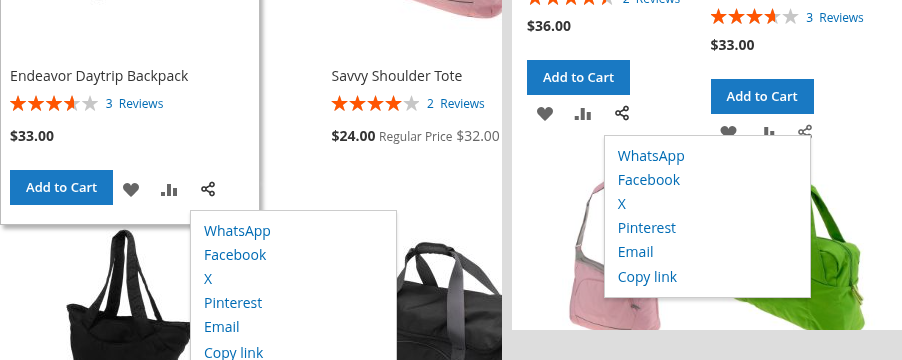
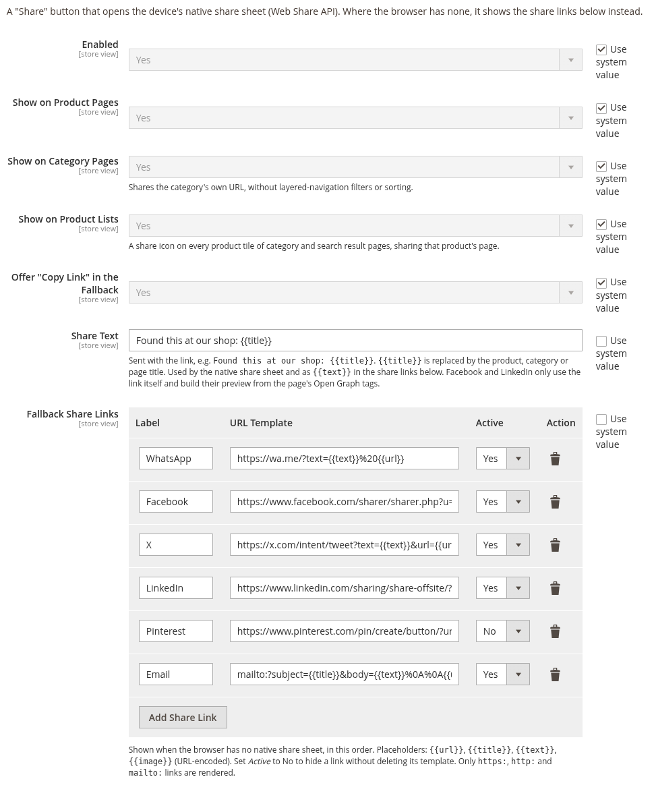

# BroCode_WebShare

A **Share** button for Magento 2 product pages, category pages, product lists and CMS pages. On phones,
tablets and most desktop browsers it opens the device's own share sheet (WhatsApp,
Messages, AirDrop, Mail, …) through the browser's
[Web Share API](https://developer.mozilla.org/en-US/docs/Web/API/Web_Share_API). Where the
browser has no share sheet, it opens a small panel of share links instead, configured in
the admin. No third-party scripts, no tracking pixels, no extra CSP entries.

```bash
composer require brocode/module-web-share
bin/magento module:enable BroCode_WebShare
bin/magento setup:upgrade
bin/magento cache:flush
```

In production mode, also run `setup:di:compile` and `setup:static-content:deploy` as
usual.



## What it does

- **Looks like Luma's own actions.** The Share control sits in the product page's
  wishlist/compare row with the same grey, uppercase, icon-first styling, and on category
  pages below the description.
- **On every product tile, too.** Category listings, quick search and advanced search get
  a share icon next to the wishlist and compare icons of each tile, sharing that product's
  page. The link panel is rendered hidden there, so a list under every tile never appears.
- **Shares the right URL.** Products and categories share their own URL — not the address
  bar, so no tracking parameters and no layered-navigation filters or sorting. The CMS
  widget shares the page it is placed on, without the query string.
- **Configurable per store view.** The share text and every share link can be switched,
  edited and translated per store view, from the admin or at deploy time.
- **Native first, links second.** A tap opens the device's share sheet. If the browser has
  none, or sharing fails, the fallback panel opens. If the customer simply closes the share
  sheet, nothing else happens.
- **Works without JavaScript.** The share links are server-rendered; without JavaScript
  they are shown as a plain list on product and category pages.
- **Accessible.** A real `<button>` with `aria-expanded`, Escape closes the panel and
  returns focus, and "Link copied" is announced through a live region.



## Configuration

*Stores > Configuration > Catalog > Catalog > Web Share*. Every setting can differ per
website and store view — untick *Use Default* on the store view to override it there.



| Setting | Default |
|---|---|
| Enabled | Yes |
| Show on Product Pages | Yes |
| Show on Category Pages | Yes |
| Show on Product Lists | Yes (one icon per product tile) |
| Offer "Copy Link" in the Fallback | Yes (shown only where the Clipboard API is available) |
| Share Text | `{{title}}` |
| Fallback Share Links | WhatsApp, Facebook, X, LinkedIn, Pinterest, Email |

### Share text

A sentence sent along with the link, for example `Found this at our shop: {{title}}` — set
it per store view to translate it. `{{title}}` becomes the product, category or page title.
The native share sheet receives it as its text, and the share links can use it as
`{{text}}`. Facebook and LinkedIn ignore both: they only take the URL and build the preview
from the page's Open Graph tags (Luma's product pages have them; stock category and CMS
pages do not, so their previews are thinner).

### Share links

Each row has a **Label**, a **URL Template** and an **Active** switch. Set *Active* to *No*
to hide a network without losing its template; delete a row to remove it for good. Rows
appear in the order they are listed. The placeholders are URL-encoded on output:

| Placeholder | Product page / tile | Category | CMS widget |
|---|---|---|---|
| `{{url}}` | product URL | category URL | page URL without query string |
| `{{title}}` | product name | category name | page title |
| `{{text}}` | the share text | the share text | the share text |
| `{{image}}` | main image (on tiles: the grid image already generated for the tile) | category image, if set | empty |

**Only `https:`, `http:` and `mailto:` templates are rendered** — the templates end up in
`href` attributes, so anything else (`javascript:`, `data:`, relative paths) is dropped
instead of output.

The defaults, and how sure each one is:

| Network | Template | Source |
|---|---|---|
| WhatsApp | `https://wa.me/?text={{text}}%20{{url}}` | WhatsApp click-to-chat (`wa.me`, `text` parameter) |
| Facebook | `https://www.facebook.com/sharer/sharer.php?u={{url}}` | Not in Meta's current docs (they document the Share Dialog, which needs an app ID); long-standing and working. Only the URL is used. |
| X | `https://x.com/intent/tweet?text={{text}}&url={{url}}` | [X web intent docs](https://docs.x.com/x-for-websites/post-button/guides/web-intent) |
| LinkedIn | `https://www.linkedin.com/sharing/share-offsite/?url={{url}}` | Not documented (LinkedIn documents a JavaScript plugin only); the de facto standard link. Only the URL is used. |
| Pinterest | `https://www.pinterest.com/pin/create/button/?url={{url}}&media={{image}}&description={{text}}` | [Pinterest save button docs](https://developers.pinterest.com/docs/web-features/buttons/) |
| Email | `mailto:?subject={{title}}&body={{text}}%0A%0A{{url}}` | `mailto:` (RFC 6068) |

All six were checked in a browser on 2026-09-26: each keeps the product URL through its
redirect or login page. Facebook, X and LinkedIn need a logged-in account to show the
prefilled dialog.

### Adding another network

Add a row with the network's share URL and the placeholders. Telegram, for example, as
[documented by Telegram](https://core.telegram.org/widgets/share):

| Label | URL Template |
|---|---|
| Telegram | `https://t.me/share/url?url={{url}}&text={{text}}` |

### Configuring it at deploy time

Everything above is ordinary store configuration, so it can be set from the command line
or pinned in `app/etc/config.php` / `env.php` like any other setting. The share links are
stored as JSON:

```bash
bin/magento config:set catalog/web_share/providers \
  '{"whatsapp":{"label":"WhatsApp","url_template":"https://wa.me/?text={{text}}%20{{url}}","active":"1"},"email":{"label":"Email","url_template":"mailto:?subject={{title}}&body={{text}}%0A%0A{{url}}","active":"1"}}'

bin/magento config:set --scope=stores --scope-code=de catalog/web_share/share_text \
  'Bei uns gefunden: {{title}}'
```

Add `--lock-config` to write the value to `app/etc/config.php` (shared across environments)
or `--lock-env` for `app/etc/env.php`; a locked value is shown read-only in the admin.

When `app/etc/config.php` changes any other way — a deploy, a `git pull`, a file copied
back — run `bin/magento app:config:import` (`setup:upgrade` does it too). Until then Magento
answers every storefront request with *The configuration file has changed*.

For CMS pages and blocks, insert the widget **Web Share Button**.

## Hooks for analytics and themes

Every share fires a `webshare:share` event on `document`:

```javascript
document.addEventListener('webshare:share', (e) => {
  // e.detail.method: "native", "copy", or the code of the fallback link that was clicked
  window.dataLayer = window.dataLayer || [];
  window.dataLayer.push({ event: 'share', method: e.detail.method, content_url: e.detail.url });
});
```

The markup uses `.brocode-web-share`, `.brocode-web-share-toggle` and
`.brocode-web-share-links`; the panel is only positioned as a dropdown once JavaScript has
added `.is-enhanced`, and opens to the left (`.is-flipped`) when it would leave the viewport.

## Requirements and limits

- Magento 2.4.x, PHP 8.1–8.4. Verified on 2.4.8-p5 with Luma, desktop and mobile widths.
- **Luma-based themes.** The styles use Magento's LESS library only, so Blank-based themes
  compile too. Hyvä does not load RequireJS components and needs a small compatibility
  template (not included).
- **Browser support for the native share sheet varies.** Mobile browsers, Safari, Edge and
  Chrome on desktop broadly support it; Firefox on desktop only behind a preference. The
  fallback panel covers every browser without it.
- The page must be served over HTTPS; the Web Share and Clipboard APIs only exist in
  secure contexts.

## License

MIT, see [LICENSE](LICENSE).

If this saves you time: [buy me a coffee](https://www.buymeacoffee.com/brosenberger).
